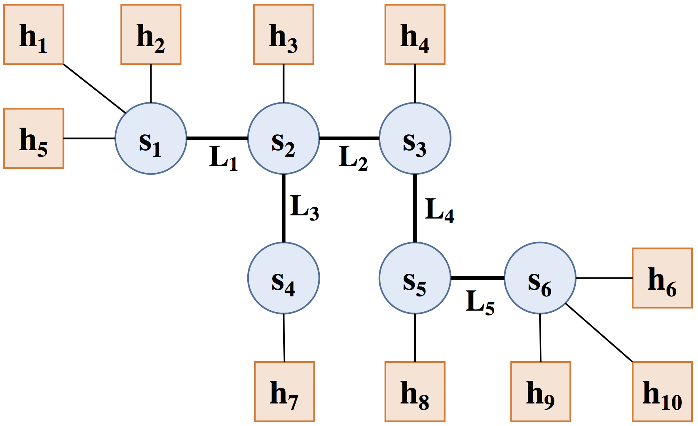

# Assignment 1: Sockets, Mininet, & Performance

### Due: Sep 26, 2018, 11:59 PM

## Overview

`iPerf` is a common tool used to measure network bandwidth. You will write your own version of this tool in C/C++ using sockets. You will then use your tools to measure the performance of virtual networks in Mininet and explain how link characteristics and multiplexing impact performance.

* [Part 1](#part1): Write `iPerfer`
* [Part 2](#part2): Mininet Tutorial
* [Part 3](#part3): Measurements in Mininet
* [Part 4](#part4): Create a Custom Topology
* [Submission Instructions](#submission-instr)

Before you start doing anything with this project, however, please [register your github username with us](https://docs.google.com/forms/d/e/1FAIpQLScOrkw2v-N6AazL8CYUFGzz1o1iSJ6YfFnAO1fVEtxSMYCPqw/viewform?usp=sf_link) if you have not done so already. This is so that we can create a private repository for you to store your code and answers for this project.

## Learning Outcomes

After completing this programming assignment, students should be able to:

* Write applications that use sockets to transmit and receive data across a network
* Explain how latency and throughput are impacted by link characteristics and multiplexing

## Clarifications

* For all latency measurements, use the one-way delay (NOT the RTT).

<a name="part1"></a>
## Part 1: Write `iPerfer`

For the first part of the assignment you will write your own version of `iPerf` to measure network bandwidth. Your tool, called `iPerfer`, will send and receive TCP packets between a pair of hosts using sockets.

**Note**: A good resource and a starting point to learn about socket programming is this [Sockets Tutorial](http://www.cs.rpi.edu/~moorthy/Courses/os98/Pgms/socket.html). You may also refer to [Beej's Guide to Network Programming Using Internet Sockets](http://beej.us/net2/bgnet.html). Discussion sections will also review the basics of socket programming.

When operating in client mode, `iPerfer` will send TCP packets to a specific host for a specified time window and track how much data was sent during that time frame; it will calculate and display the bandwidth based on how much data was sent in the elapsed time. When operating in server mode, `iPerfer` will receive TCP packets and track how much data was received during the lifetime of a connection; it will calculate and display the bandwidth based on how much data was received and how much time elapsed during the connection.

### Server Mode

To operate `iPerfer` in server mode, it should be invoked as follows:

`./iPerfer -s -p <listen_port>`

* `-s` indicates this is the `iPerfer` server which should consume data
* `listen_port` is the port on which the host is waiting to consume data; the port should be in the range 1024 ≤ listen port ≤ 65535

For simplicity, you can assume these arguments will appear exactly in the order listed above.

You can use the presence of the `-s` option to determine `iPerfer` should operate in server mode.

If arguments are missing or extra arguments are provided, you should print the following and exit:

`Error: missing or extra arguments`

If the listen port argument is less than 1024 or greater than 65535, you should print the following and exit:

`Error: port number must be in the range of [1024, 65535]`

When running as a server, `iPerfer` must listen for TCP connections from a client and receive data as quickly as possible. It should then wait for some kind of message from the client indicating it is done sending data (we will call this a FIN message). The server should then send the client an acknowledgement to this FIN message. It is up to you to decide the format of these FIN and acknowledgement messages.

Data should be read in chunks of 1000 bytes. Keep a running total of the number of bytes received.

After the client has closed the connection, `iPerfer` server must print a one-line summary in the following format:

`Received=X KB, Rate=Y Mbps`

where X stands for the total number of bytes received (in kilobytes), and Y stands for the rate at which traffic could be read in megabits per second (Mbps).
Note X should be an integer and Y should be a decimal with three digits after the decimal mark.

For example:
`Received=6543 KB, Rate=5.234 Mbps`

The `iPerfer` server should shut down gracefully after it handles one connection from a client.

### Client Mode

To operate `iPerfer` in client mode, it should be invoked as follows:

`./iPerfer -c -h <server_hostname> -p <server_port> -t <time>`

* `-c` indicates this is the `iPerfer` client which should generate data
* `server_hostname` is the hostname or IP address of the `iPerfer` server which will consume data
* `server_port` is the port on which the remote host is waiting to consume data; the port should be in the range 1024 ≤ `server_port` ≤ 65535
* `time` is the duration in seconds for which data should be generated

For simplicity, you can assume these arguments will appear exactly in the order listed above.

You can use the presence of the `-c` option to determine `iPerfer` should operate in client mode.

If any arguments are missing or extra arguments are provided, you should print the following and exit:

`Error: missing or extra arguments`

If the server port argument is less than 1024 or greater than 65535, you should print the following and exit:

`Error: port number must be in the range of [1024, 65535]`

If the time argument ends up parsing to less than 0, you should print the following and exit:

`Error: time argument must be greater than 0`

If both the port and time argument are invalid, print only the port error message.

When running as a client, `iPerfer` must establish a TCP connection with the server and send data as quickly as possible for `time` seconds. Data should be sent in chunks of 1000 bytes and the data should be all zeros. Keep a running total of the number of bytes sent. After the client finishes sending its data, it should send a FIN message and wait for an acknowledgement before exiting the program.

`iPerfer` client must print a one-line summary in the following format:

`Sent=X KB, Rate=Y Mbps`

where X stands for the total number of bytes sent (in kilobytes), and Y stands for the rate at which traffic could be read in megabits per second (Mbps).
Note X should be an integer and Y should be a decimal with three digits after the decimal mark.

For example:
`Sent=6543 KB, Rate=5.234 Mbps`

You should assume 1 kilobyte (KB) = 1000 bytes (B) and 1 megabyte (MB) = 1000 KB. As always, 1 byte (B) = 8 bits (b).

**Note**: When calculating the rate, do not use the `time` argument, rather measure the time elapsed from when the client first starts sending data to when it receives its acknowledgement message.

### Testing

You can test `iPerfer` on any machines you have access to. However, be aware the certain ports may be blocked by firewalls on end hosts or in the network, so you may not be able to test your program on all hosts or in all networks.

The primary mode for testing should be using Mininet. You should complete [Part 2](#part2) of this assignment before attempting that.

You should receive the same number of bytes on the server as you sent from the client. However, the timing on the server may not perfectly match the timing on the client. Hence, the bandwidth reported by client and server may be slightly different.

The autograder will be released about halfway through the assignment. Instructions for submission are [here](#submission-instr). It is not meant to be your primary source of testing/debugging, but is rather intended for you to see your overall progress.

<a name="part2"></a>
## Part 2: Mininet Tutorial

To test `iPerfer`, you will learn how to use Mininet to create virtual networks and run simple experiments. According to the [Mininet website](http://mininet.org/), *Mininet creates a realistic virtual network, running real kernel, switch and application code, on a single machine (VM or native), in seconds, with a single command.* We will use Mininet in programming assignments throughout the semester.

### Running Mininet

It is best advised to run Mininet in a virtual machine (VM). We will be using [VirtualBox](https://www.virtualbox.org/), which is a free and open-source hypervisor. Please download and install the latest version of VirtualBox.

You will be using our VM image ([link here](https://drive.google.com/open?id=1ix33--G7CagnjbDKgRhpPdYsGwNaZvf1)) with Mininet 2.3 pre-installed. Please download and import the VM image into VirtualBox. To transfer files to/from your VM you can use the Shared Folder feature provided in VirtualBox. We will go over this in more detail in discussion.

You are welcome to try to set up your own testing environment using the methods outlined in options 2 and 3 [here](http://mininet.org/download/#option-2-native-installation-from-source), however we will only officially be supporting the provided VM above.

### Mininet Walkthrough

Once you have a Mininet VM, you should complete the following sections of the standard [Mininet walkthrough](http://mininet.org/walkthrough/):

* All of Part 1, except the section "Start Wireshark"
* The first four sections of Part 2—"Run a Regression Test", "Changing Topology Size and Type", "Link variations", and "Adjustable Verbosity"
* All of Part 3

At some points, the walkthrough will talk about software-defined networking (SDN) and OpenFlow. We will discuss these during the second half of the semester, so you do not need to understand what they mean right now; you just need to know how to run and interact with Mininet. We will review using mininet in discussion as well.

You do not need to submit anything for this part of the assignment.

<a name="part3"></a>
## Part 3: Measurements in Mininet

For the third part of the assignment you will use the tool you wrote (`iPerfer`) and the standard latency measurement tool `ping` (`ping` measures RTT), to measure the bandwidth and latency in a virtual network in Mininet. You must include the output from some of your experiments and the answers to the questions below in your submission. Your answers to the questions should be put in the file `answers.txt` **that we provide**. Please do **NOT** change the format of the `answers.txt` file (none of the answers to the questions should take more than one or two sentences).

Read the `ping` man page to learn how to use it.

A python script to run Mininet with the topology described below is provided [here](https://github.com/mosharaf/eecs489/tree/master/Assignments/Assignment-1/starter_code) along with other files that you will find useful in completing this assignment.

To run Mininet with the provided topology, run the Python script `assignment1_topology.py` using sudo:

`sudo python assignment1_topology.py`

This will create a network with the following topology:



If you have trouble launching the script, a common fix is to first try running `sudo mn -c`, and then try launching the script again.

Hosts (`h1` to `h10`) are represented by squares and switches (`s1` to `s6`) are represented by circles; the names in the diagram match the names of hosts and switches in Mininet. The hosts are assigned IP addresses 10.0.0.1 through 10.0.0.10; the last number in the IP address matches the host number.

**NOTE:** When running ping and `iPerfer` in Mininet, you must use IP addresses, not hostnames.

#### Q1: Link Latency and Throughput
First, you should measure the RTT and bandwidth of each of the five individual links between switches (`L1` - `L5`). You should run ping with 20 packets and store the output of the measurement on each link in a file called `latency_L#.txt`, replacing # with the link number from the topology diagram above. You should run `iPerfer` for 20 seconds and store the output of the measurement on each link in a file called `throughput_L#.txt`, replacing # with the link number from the topology diagram above.

#### Q2: Path Latency and Throughput
Now, assume `h1` wants to communicate with `h10`. What is the expected latency and throughput of the path between the hosts? Put your prediction in the `answers.txt` file under question 2.

Measure the latency and throughput between `h1` and `h10` using `ping` and `iPerfer`. It does not matter which host is the client and which is the server. Use the same parameters as above (20 packets / 20 seconds) and store the output in files called `latency_Q2.txt` and `throughput_Q2.txt`. Put the average RTT and measured throughput in the `answers.txt` file and explain the results. If your prediction was wrong, explain why.

#### Q3: Effects of Multiplexing
Next, assume multiple hosts connected to `s1` want to simultaneously talk to hosts connected to `s6`. What is the expected latency and throughput when two pairs of hosts are communicating simultaneously? Put your predictions in your `answers.txt` file under question 3.1.

Use `ping` and `iPerfer` to measure the latency and throughput when there are two pairs of hosts communicating simultaneously; it does not matter which pairs of hosts are communicating as long as one is connected to `s1` and one is connected to `s6`. Use the same parameters as above. You do not need to submit the raw output, but you should put the average RTT and measured throughput for each pair in your `answers.txt` file under question 3.1 and explain the results. If your prediction was wrong, explain why.

Repeat for three pairs of hosts communicating simultaneously and put your answers in `answers.txt` under question 3.2.

Do not worry too much about starting the clients at the exact same time. So long as the connections overlap significantly, you should achieve the correct results. One simple way is to open up terminals for each of the hosts you will use, start the iPerfer servers, type in the iPerfer client command on each of the client hosts without hitting ENTER, and then quickly hit ENTER on all client hosts so that they start at roughly the same time.

#### Q4: Effects of Latency
Lastly, assume `h1` wants to communicate with `h10` at the same time `h3` wants to communicate with `h8`. What is the expected latency and throughput for each pair? Put your prediction in your `answers.txt` file under question 4.

Use `ping` and `iPerfer` to conduct measurements, storing the output in files called `latency_h1-h10.txt`, `latency_h3-h8.txt`, `throughput_h1-h10.txt`, and `throughput_h3-h8.txt`. Put the average RTT and measured throughput in your `answers.txt` file and explain the results. If your prediction was wrong, explain why.

<a name="part4"></a>
## Part 4: Create a Custom Topology
For the last part of this assignment, write a python script to create a custom network topology in Mininet that has at least 5 hosts and 5 switches. Save your python script as `<uniqname>_topology.py`. You might find looking into the source code for `assignment1_topology.py` particularly helpful.

Finally, create a visualization of your custom topology (using circles to denote switches and squares to represent hosts) and save it as `<uniqname>_topology.png`.

<a name="submission-instr"></a>
## Submission Instructions
Submission to the autograder will be done [here](https://eecs489.eecs.umich.edu/).

To submit:
1. `git push` your work to the github repository we provided for the assignment.
2. Go to autograder website specified above. You can specify what branch on your repository you want us to grade.
3. Press submit. We will email your results once the autograder is finished.

Your assigned repository must contain:

* The source code for `iPerfer`: all source files for `iPerfer` should be in a folder called `iPerfer`; the folder should include a `Makefile` to compile the sources. The autograder expects an `iPerfer` executable to be present after running `make` in this directory.
* Your measurement results and answers to the questions from Part 3: all results and a text file called `answers.txt` should be in a folder called `measurements`.
* Your custom network topology code and its visualization (`<uniqname>_topology.py` and `<uniqname>_topology.png`).

Example final structure of repository:
```
$ tree ./repo-checkout/
./repo-checkout/
├── README.md
├── assignment1_topology.png
├── assignment1_topology.py
├── iPerfer
│   ├── ** source files **
│   ├── Makefile
│   └── iPerfer <- executable from running make
├── joebb_topology.png
├── joebb_topology.py
└── measurements
    ├── answers.txt
    ├── latency_L1.txt
    ├── latency_L2.txt
    ├── latency_L3.txt
    ├── latency_L4.txt
    ├── latency_L5.txt
    ├── latency_Q2.txt
    ├── latency_h1-h10.txt
    ├── latency_h3-h8.txt
    ├── throughput_L1.txt
    ├── throughput_L2.txt
    ├── throughput_L3.txt
    ├── throughput_L4.txt
    ├── throughput_L5.txt
    ├── throughput_Q2.txt
    └── throughput_h1-h10.txt
```


When grading your assignment, we will **ONLY** pull from your assigned repository, and only look at commits before the deadline.

## Acknowledgements
This programming assignment is based on Aditya Akella's Assignment 1 from Wisconsin CS 640: Computer Networks.
