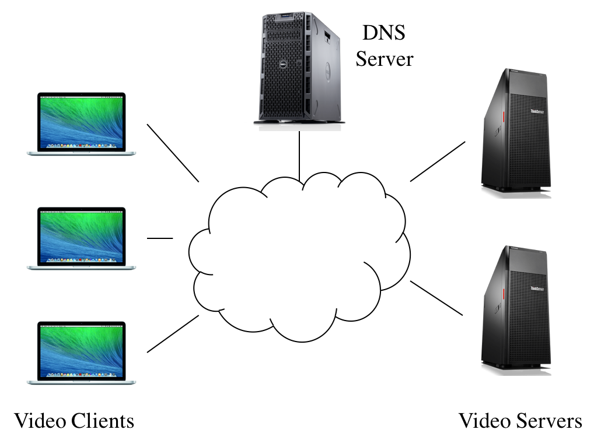
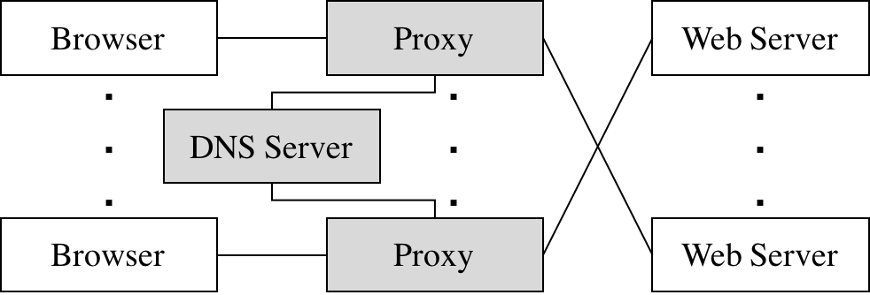
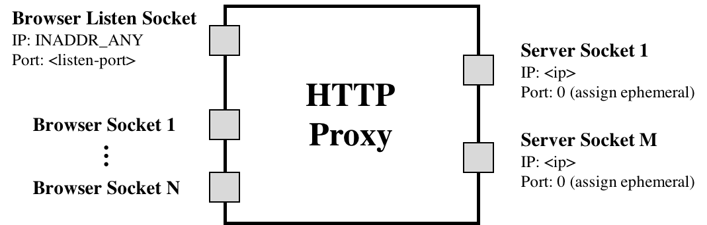
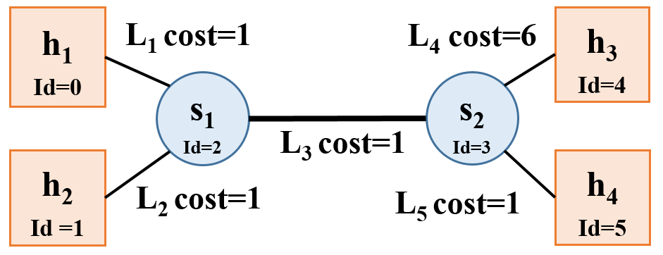

# Assignment 2: Video Streaming via CDN

### Due: October 24th, 2021 at 11:59 PM

## Table of contents
* [Overview](#overview)
* [Clarifications](#clarifications)
* [Environment Setup](#environment)
* [Part 1](#part1): Bitrate Adaptation in HTTP Proxy
* [Part 2](#part2): DNS Load Balancing
* [Submission Instructions](#submission-instr)
* [Autograder](#autograder)

<a name="overview"></a>
## Overview

Video traffic dominates the Internet. In this project, you will explore how video content distribution networks (CDNs) work. In particular, you will implement adaptive bitrate selection, DNS load balancing, and an HTTP proxy server to stream video at high bit rates from the closest server to a given client.

This project is divided into Part 1 and Part 2. We recommend that you work on them simultaneously (both of them can be independently tested), and finally integrate both parts together.



### Video CDNs in the Real World
The figure above depicts a high level view of what this system looks like in the real world. Clients trying to stream a video first issue a DNS query to resolve the service's domain name to an IP address for one of the CDN's content servers. The CDN's authoritative DNS server selects the “best” content server for each particular client based on
(1) the client's IP address (from which it learns the client's geographic location) and
(2) current load on the content servers (which the servers periodically report to the DNS server).

Once the client has the IP address for one of the content servers, it begins requesting chunks of the video the user requested. The video is encoded at multiple bitrates; as the client player receives video data, it calculates the throughput of the transfer and requests the highest bitrate the connection can support.

### Video CDN in this Assignment
Implementing an entire CDN is difficult; instead, you'll focus on a simplified version. First, your entire system will run on one host and rely on mininet to run several processes with arbitrary IP addresses on one machine. Mininet will also allow you to assign arbitrary link characteristics (bandwidth and latency) to each pair of “end hosts” (processes).



You'll write the gray-shaded components in the figure above.

**Browser.** You'll use an off-the-shelf web browser (Firefox) to play videos served by your CDN (via your proxy).

**Proxy.** Rather than modify the video player itself, you will implement adaptive bitrate selection in an HTTP proxy. The player requests chunks with standard HTTP GET requests; your proxy will intercept these and modify them to retrieve whichever bitrate your algorithm deems appropriate.

**Web Server.** Video content will be served from an off-the-shelf web server (Apache). As with the proxy, you will run multiple instances of Apache on different IP addresses to simulate a CDN with several content servers.

**DNS Server.** You will implement a simple DNS that supports only a small portion of actual DNS's functionality. Your server will respond to each request with the “best” server for that particular client.

To summarize, this assignment has the following components:

* [Part 1](#part1): Bitrate Adaptation in HTTP Proxy
* [Part 2](#part2): DNS Load Balancing

## Learning Outcomes

After completing this programming assignment, students should be able to:

* Explain how HTTP proxies, DNS servers, and video CDNs work
* Create topologies and change network characteristics in Mininet to test networked systems

<a name="clarifications"></a>
## Clarifications

* For the proxy you implement in part 1, you will need to parse some HTTP traffic. To make your life easier for this project, you don't need to be concerned about parsing all the information in these HTTP messages. There are only two things that you need to care about searching for: `\r\n\r\n` and `Content-Length`. The former is used to denote the end of an HTTP header, and the latter is used to signify the size of the HTTP body in bytes.

* The proxy should be able to support multiple browsers playing videos simultaneously. This means you should test with multiple browsers all connecting to the same proxy. In addition you should also test with multiple proxies each serve some number of browser(s), in order to make sure that each proxy instance does not interfere with others. 

* While testing the proxy you implement in part 1, you may notice that one browser may sometimes open multiple connections to your proxy server. Your proxy should still continue to function as expected in this case. In order to account for these multiple connections, you may use the browser IP address to uniquely identify each connection (this implies that while testing your proxy server, each browser will have a unique IP address. For example, only one browser will have an IP address of 10.0.0.2).

* Throughput should be measured on each fragment. For example, throughput should be calculated separately for both Seg1-Frag1 and Seg1-Frag2.

<a name="environment"></a>

## Environment Setup
[We will provide a VM](https://www.dropbox.com/s/ajvta4j2t0bu42i/EECS489VM-1804-A2A3.ova?dl=0) that has all the components you need to get started on the assignment. While we tried to make the base VM work for all the projects, unfortunately this didn't come to fruition. Starting fresh also ensures a working environment free from accidental changes that may have been made in the first project.

**We encourage you to use VMware instead of Virtue Box for this and following projects, which is more compatible with different OS and is free with personal license.** For Windows and Linux users, we recommend [VMware Workstation Player](https://www.vmware.com/products/workstation-player/workstation-player-evaluation.html). For Mac users, we recommend [VMware Fusion Player](https://customerconnect.vmware.com/web/vmware/evalcenter?p=fusion-player-personal).


You may install tools that suit your workflow. **But DO NOT update the software in the VM.** 
You can find a guide on [how to troubleshoot the VM here](https://eecs388.org/vmguide.html#troubleshooting).

This VM includes mininet, Apache, and all the files we will be streaming in this project. Both the username and password for this VM are `eecs489vm`. To start the Apache server, simply run the python script we provide by doing the following:

`python start_server.py <host_number>`

Here `<host_number>` is a required command line argument that specifies what host you are running on Mininet. This is important as if you're running on h1 in Mininet (which is given the IP address 10.0.0.1), passing in `1` into the `<host_number>` argument will help ensure that the Apache server instance will be bound to the 10.0.0.1 IP address. The `<host_number>` argument must be between 1 and 8.

The Apache servers would not automatically stop after mininet is closed. You MUST manually stop the server. To stop the Apache server, run:

`sudo killall httpd`


Like any HTTP web server (not HTTPS) these instances of Apache will be reachable on TCP port `80`. For simplicity, all of our web traffic for this assignment will be unencrypted and be done over HTTP.

For this project, we will be using an off the shelf browser (in this case, Firefox). To launch Firefox for this project, run the following command:

`python launch_firefox.py <profile_num>`

Here `<profile_num>` is a required command line argument that specifies the instance of Firefox you are launching. We support launching profiles 1-8, however, should you feel the need to test more thoroughly, you can launch it with a different number and simply create a new profile as needed. To ensure a separate connection for each instance of Firefox, we recommend that you launch Firefox with a different profile number (otherwise you might notice that different Firefox instances will sometimes share a connection with your proxy server).

Also make sure you don't modify the firefox profiles we set up as well as the configuration files inside the current firefox build directory.

To be clear, you launch the web server, the firefox browser, the proxy server, and the DNS server all inside Mininet. You should test your code inside Mininet from day 1.

We're leaving it up to you to write your own Mininet topology script for testing the package as a whole. A simple Starfish topology (all hosts connected to one switch in the middle) should suffice for testing.

> **NOTE:** For this project, we are disabling caching in the browser. If you do choose to create a new profile, please double check if caching is disabled by going to the `about:config` page and setting both `browser.cache.disk.enable` and `browser.cache.memory.enable` to `false`.

<a name="part1"></a>
## Part 1: Bitrate Adaptation in HTTP Proxy

Many video players monitor how quickly they receive data from the server and use this throughput value to request better or lower quality encodings of the video, aiming to stream the highest quality encoding that the connection can handle. Instead of modifying an existing video client to perform bitrate adaptation, you will implement this functionality in an HTTP proxy through which your browser will direct requests.

You are to implement a simple HTTP proxy, `miProxy`. It accepts connections from web browsers, modifies video chunk requests as described below, resolves the web server's DNS name, opens a connection with the resulting IP address, and forwards the modified request to the server. Any data (the video chunks) returned by the server should be forwarded, *unmodified*, to the browser.

`miProxy` should listen for browser connections on `INADDR_ANY` on the port specified on the command line. It should then connect to a web server either specified on the command line or issue a DNS query to find out the IP address of the server to contact (this is covered in part 2).



`(assign ephemeral)` is referring to the fact that the kernel will pick the proxy's TCP port when it connects to the web server's port `80`. Nothing more than the proxy calling `connect()` is happening here.

`miProxy` should accept multiple concurrent connections from clients (Firefox web browser) using `select()` and be able to handle the required HTTP 1.1 requests for this assignment (e.g., HTTP `GET`).

The picture above shows `miProxy` connected to multiple web servers, which would be the case if `miProxy` issued a DNS request for each new client connection received (e.g each new connection from an instance of Firefox). This is one approach for utilizing the DNS `nameserver` you will write in part 2. Another approach would be to issue a DNS request **once** when `miProxy` starts up, and direct all client requests to one web server for the entire runtime of `miProxy`. Either approach is acceptable for grading purposes, but the former is preferred because it provides more efficient load balancing. The former approach is also closer to the behavior of an actual load balancing proxy.

We will cover the basic usage of `select()` in the discussion.

> *Note: A good resource for socket programming is [Beej's Guide to Network Programming Using Internet Sockets](https://beej.us/guide/bgnet/html/).*

### Throughput Calculation

Your proxy measure the the throughput between the server and ifself to determine the bitrate. Your proxy should estimate each stream's throughput once per chunk. Note the start time of each chunk when your proxy started receiving the chunk from the server and save another timestamp when you have finished receiving the chunk from the server. Given the size of the chunk, you can now compute the throughput by dividing chunk size by time window.

Each video is a sequence of chunks. To smooth your throughput estimation, you should use an exponentially-weighted moving average (EWMA). Every time you make a new measurement (as outlined above), update your current throughput estimate as follows:

`T_cur = alpha * T_new + (1 - alpha) * T_cur`

The constant `0 ≤ alpha ≤ 1` controls the tradeoff between a smooth throughput estimate (`alpha` closer to 0) and one that reacts quickly to changes (`alpha` closer to 1). You will control `alpha` via a command line argument. When a new stream starts, set `T_cur` to the lowest available bitrate for that video.

### Choosing a Bitrate

Once your proxy has calculated the connection's current throughput, it should select the highest offered bitrate the connection can support. For this project, we say a connection can support a bitrate if the average throughput is at least 1.5 times the bitrate. For example, before your proxy should request chunks encoded at 1000 Kbps, its current throughput estimate should be at least 1.5 Mbps.

Your proxy should learn which bitrates are available for a given video by parsing the manifest file (the ".f4m" initially requested at the beginning of the stream). The manifest is encoded in XML; each encoding of the video is described by a `<media>` element, whose bitrate attribute you should find.

Your proxy replaces each chunk request with a request for the same chunk at the selected bitrate (in Kbps) by modifying the HTTP request’s `Request-URI`. Video chunk URIs are structured as follows:

`/path/to/video/<bitrate>Seg<num>-Frag<num>`

For example, suppose the player requests fragment 3 of chunk 2 of the video `big_buck_bunny.f4m` at 500 Kbps:

`/path/to/video/500Seg2-Frag3`

To switch to a higher bitrate, e.g., 1000 Kbps, the proxy should modify the URI like this:

`/path/to/video/1000Seg2-Frag3`

> **IMPORTANT:** When the video player requests `big_buck_bunny.f4m`, you should instead return `big_buck_bunny_nolist.f4m`. This file does not list the available bitrates, preventing the video player from attempting its own bitrate adaptation. You proxy should, however, fetch `big_buck_bunny.f4m` for itself (i.e., don’t return it to the client) so you can parse the list of available encodings as described above. Your proxy should keep this list of available bitrates in a global container (not on a connection by connection basis).

### Running `miProxy`
To operate `miProxy`, it should be invoked in one of two ways

**Method 1** - No DNS `nameserver` functionality, hard coded web server IP:

This mode of operation will be for testing your proxy without a working DNS server from part 2.

`./miProxy --nodns <listen-port> <www-ip> <alpha> <log>`

* `--nodns` This flag indicates the proxy won't use DNS to get the web server IP.
* `listen-port` The TCP port your proxy should listen on for accepting connections from your browser.
* `www-ip` Argument specifying the IP address of the web server from which the proxy should request video chunks. Again, this web server is reachable at port TCP port `80`.
* `alpha` A float in the range [0, 1]. Uses this as the coefficient in your EWMA throughput estimate.
* `log` The file path to which you should log the messages as described below.

**Method 2** - Full and final functionality (after part 2 is implemented):

In this mode of operation your proxy should obtain the web server's IP address by querying your DNS server for the name `video.cse.umich.edu`.

`./miProxy --dns <listen-port> <dns-ip> <dns-port> <alpha> <log>`

* `--dns` This flag indicates the proxy will use DNS to obtain the web server IP.
* `listen-port` The TCP port your proxy should listen on for accepting connections from your browser.
* `dns-ip` IP address of the DNS server.
* `dns-port` Port number DNS server listens on.
* `alpha` A float in the range [0, 1]. Uses this as the coefficient in your EWMA throughput estimate.
* `log` The file path to which you should log the messages as described below.

> *Note: for simplicity, arguments will appear exactly as shown above (for both modes) during testing and grading. Error handling with the arguments is not explicitly tested but is highly recommended. At least printing the correct usage if something went wrong is worthwhile.*

> *Also note: we are using our own implementation of DNS on top of TCP, not UDP.*

### miProxy Logging
`miProxy` must create a log of its activity in a very particular format. If the log file already exists, `miProxy` overwrites the log. *After each chunk-file response from the web server*, it should append the following line to the log:

`<browser-ip> <chunkname> <server-ip> <duration> <tput> <avg-tput> <bitrate>`

* `broswer-ip` IP address of the browser issuing the request to the proxy.
* `chunkname` The name of the file your proxy requested from the web server (that is, the modified file name in the modified HTTP GET message).
* `server-ip` The IP address of the server to which the proxy forwarded this request.
* `duration` A floating point number representing the number of seconds it took to download this chunk from the web server to the proxy.
* `tput` The throughput you measured for the current chunk in Kbps.
* `avg-tput` Your current EWMA throughput estimate in Kbps.
* `bitrate` The bitrate your proxy requested for this chunk in Kbps.

### Testing
To play a video through your proxy, you launch an instance of the Apache server, launch Firefox (see above), and point the browser on your VM to the URL `http://<proxy_ip_addr>:<listen-port>/index.html`.


<a name="part2"></a>
## Part 2: DNS Load Balancing

To spread the load of serving videos among a group of servers, most CDNs perform some kind of load balancing. A common technique is to configure the CDN's authoritative DNS server to resolve a single domain name to one out of a set of IP addresses belonging to replicated content servers. The DNS server can use various strategies to spread the load, e.g., round-robin, shortest geographic distance, or current server load (which requires servers to periodically report their statuses to the DNS server). 

In this part, you will write a simple DNS server that implements load balancing in two different ways: round-robin and geographic distance. 

### Message Format for Our DNS Implemetation
In order for your proxy to be able to query your DNS server, you must also write an accompanying DNS resolution library. The two pieces should communicate using the DNS classes we provide (`DNSHeader.h`, `DNSQuestion.h`, and `DNSRecord.h`). You can read more about what each of the fields in these classes represents [here](https://datatracker.ietf.org/doc/html/rfc1035#section-4.1.1). To make your life easier:

* `AA` Set this to 0 in requests, 1 in responses.

* `RD` Set this to 0 in all messages.

* `RA` Set this to 0 in all messages.

* `Z` Set this to 0 in all messages.

* `NSCOUNT` Set this to 0 in all messages.

* `ARCOUNT` Set this to 0 in all messages.

* `QTYPE` Set this to 1 in all requests (asking for an A record).

* `QCLASS` Set this to 1 in all requests (asking for an IP address).

* `TYPE` Set this to 1 in all responses (returning an A record).

* `CLASS` Set this to 1 in all responses (returning an IP address).

* `TTL` Set this to 0 in all responses (no caching).

We are also providing encoding and decoding functions to serialize and deserialize your DNS query and response. Be sure to use the functions we provide so that your DNS server can be properly tested by autograder. In our implementation of DNS, the query consists of DNS header and question, and the response consists of DNS header and record.

**There are some slight nuances in the format of our DNS messages**. The main difference between what we do and what the RFC specifies is that the response should contain header + question + record, whereas our response is only header + record. Also, the size of each **encoded** object (represented as a 4-byte integer) is sent before sending the contents of the object. The overall procedure is outlined below:

1. `miProxy` sends integer designating the size of DNS header -> `miProxy` sends DNS header via encode() -> `miProxy` sends integer designating the size of DNS Question -> `miProxy` sends DNS Question via encode()

2. `nameserver` recvs() integer designating size of DNS Header -> `nameserver` recvs() DNS header via decode() -> `nameserver` recvs() integer designating size of DNS Question -> `nameserver` recvs() DNS Question via decode()

3. `nameserver` sends integer designating size of DNS Header -> `nameserver` sends DNS Header via encode() -> `nameserver` sends integer designating size of DNS Record -> `nameserver` sends DNS Record via encode()

4. `miProxy` recvs() integer designating size of DNS Header -> `miProxy` recvs() DNS header via decode() -> `miProxy` recvs() integer designating size of DNS Record -> `miProxy` recvs() DNS Record via decode()

**Remember to use `htonl` and `ntohl` when sending/receiving integers over the network!**

### Round-Robin Load Balancer
One of the ways you will implement `nameserver` is as a simple round-robin based DNS load balancer. It should take as input a list of video server IP addresses on the command line; it responds to each request to resolve the name `video.cse.umich.edu` by returning the next IP address in the list, cycling back to the beginning when the list is exhausted.

`nameserver` will bind to an IP address and port specified as command line arguments. It responds **only** to requests for `video.cse.umich.edu`; any other requests should generate a response with `RCODE` 3.

Example text file format in `sample_round_robin.txt`:
```
10.0.0.1
10.0.0.2
10.0.0.3
```

### Geographic Distance Load Balancer
Next you’ll make your DNS server somewhat more sophisticated. Your load balancer must return the closest video server to the client based on the proxy’s IP address. In the real world, this would be done by querying a database mapping IP prefixes to geographic locations. For your implementation, however, you will be given information in a text file about the entire state of the network, and your server will have to return to a given client its closest geographic server.

The text file will be represented in the following way:
```
NUM_NODES: <number of hosts and switches in the network>
<host_id> <CLIENT|SWITCH|SERVER> <IP address|NO_IP>
(repeats NUM_NODES - 1 times)
NUM_LINKS: <number of links in the network>
<origin_id> <destination_id> <cost>
(repeats NUM_LINKS - 1 times)
```



As an example, the network shown above will have the following text file, `sample_geography.txt`:
```
NUM_NODES: 6
0 CLIENT 10.0.0.1
1 CLIENT 10.0.0.2
2 SWITCH NO_IP
3 SWITCH NO_IP
4 SERVER 10.0.0.3
5 SERVER 10.0.0.4
NUM_LINKS: 5
0 2 1
1 2 1
2 3 1
3 4 6
3 5 1
```

To operate `nameserver`, it should be invoked as follows:

`./nameserver [--geo|--rr] <port> <servers> <log>`

* `--geo` This flag specifies that `nameserver` will operate in the geography/distance based load balancing scheme.
* `--rr` This flag specifies that `nameserver` will operate in the round-robin based load balancing scheme.
* `port` The port on which your server should listen.
* `servers` A text file containing a list of IP addresses, one per line, belonging to content servers if `--rr` is specified. Otherwise, if `--geo` is specified, it will be a text file describing the network topology as explained above.
* `log` The file path to which you should log the messages as described below.

**Exactly one of `--rr` or `--geo` will be specified.**

> *Note: for simplicity, arguments will appear exactly as shown above (for both modes) during testing and grading. Error handling with the arguments is not explicitly tested but is highly recommended. At least printing the correct usage if something went wrong is worthwhile.*

### nameserver Logging
Your DNS server must log its activity in a specific format. If the log specified by the user already exists, your DNS server overwrites the log. *After each* valid DNS query it services, it should append the following line to the log:

`<client-ip> <query-name> <response-ip>`

* `client-ip` The IP address of the client who sent the query.
* `query-name` The hostname the client is trying to resolve.
* `response-ip` The IP address you return in response.

### queryDNS utility

 `queryDNS` (in the starter_code directory) sends a DNS query to `nameserver` (just like a `miProxy` does), and outputs the reponse from DNS server. So you can test your `nameserver` using `queryDNS` without `miProxy`.

 The autograder uses queryDNS for the `nameserver` only test cases, so make sure your code is compatible.

 The command line to use `queryDNS` is:
 ```
<path to the binary>/queryDNS <IP of nameserver> <port of nameserver>
 ```

 If everything goes well, you should get responses like `10.0.0.1`, `10.0.0.2` and `10.0.0.3`.

<a name="submission-instr"></a>
## Submission Instructions
Submission to the autograder will be done [here](https://eecs489.eecs.umich.edu/). You will have 3 submissions per day (once the autograder is released).

To submit:
1. `git push` your work to the github repository we provided for the assignment.
2. Go to autograder website specified above. You can specify what branch on your repository you want us to grade.
3. Press submit. Your results will show up on that page once grading is finished.

Your assigned repository must contain:

* The source code for `miProxy`: all source files and a Makefile for `miProxy` should be in the path `<your_group_repo>/miProxy`
* The source code for `nameserver`: all source files and a Makefile for `nameserver` should be in the path `<your_group_repo>/nameserver`

Example final structure of repository:
```
$ tree ./p2-joebb-and-partners/
./p2-joebb-and-partners/
├── miProxy
│   ├── Makefile <- supports "make clean" and "make"
│   ├── ** source c or cpp files **
│   └── miProxy  <- Binary executable present after running "make"
├── nameserver
│   ├── Makefile <- supports "make clean" and "make"
│   ├── ** source c or cpp files **
│   └── nameserver  <- Binary executable present after running "make"
└── starter_files
    ├── DNSHeader.h
    ├── DNSQuestion.h
    ├── DNSRecord.h
    ├── sample_geography.txt
    ├── sample_round_robin.txt
    ├── launch_firefox.py
    └── start_server.py
```


<a name="autograder"></a>
## Autograder
The autograder will be released roughly halfway through the assignment. You are encouraged to design tests by yourselves to fully test your proxy server and DNS server. You should *NEVER* rely on the autograder to debug your code. Clarifications on the autograder will be added in this section:

Our autograder runs the following versions of gcc/g++, please make sure your code is compatible.
```
$ gcc --version
gcc (Ubuntu 7.5.0-3ubuntu1~18.04) 7.5.0
Copyright (C) 2017 Free Software Foundation, Inc.
This is free software; see the source for copying conditions.  There is NO
warranty; not even for MERCHANTABILITY or FITNESS FOR A PARTICULAR PURPOSE.

$ g++ --version
g++ (Ubuntu 7.5.0-3ubuntu1~18.04) 7.5.0
Copyright (C) 2017 Free Software Foundation, Inc.
This is free software; see the source for copying conditions.  There is NO
warranty; not even for MERCHANTABILITY or FITNESS FOR A PARTICULAR PURPOSE.
```

## Acknowledgements
This programming assignment is based on Peter Steenkiste's Project 3 from CMU CS 15-441: Computer Networks.
