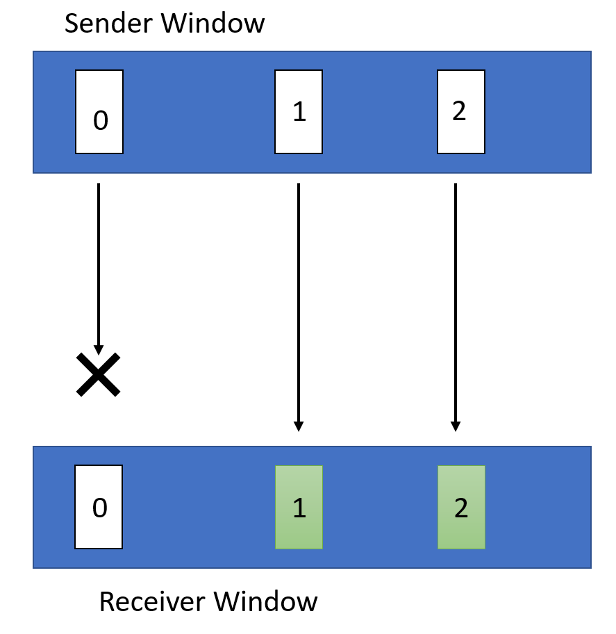
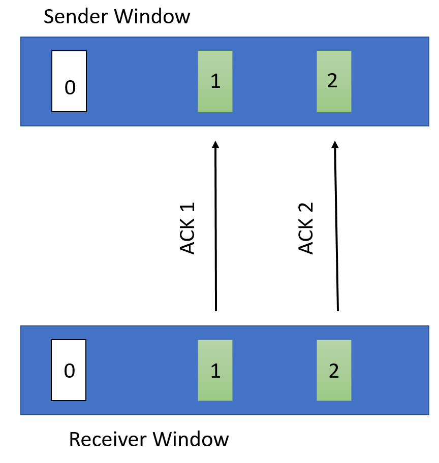

# Assignment 3: Reliable Transport

### Due: November 16th, 2018 at 11:59 PM

## Overview

In this project, you will build a simple reliable transport protocol, WTP, **on top of UDP**. Your WTP implementation must provide in­order, reliable delivery of UDP datagrams in the presence of events like packet loss, delay, corruption, duplication, and re­ordering.

There are a variety of ways to ensure a message is reliably delivered from a sender to a receiver. You are to implement a sender (`wSender`) and a receiver (`wReceiver`) that follows the following WTP specification.

### WTP Specification
WTP sends data in the format of a header, followed by a chunk of data.

WTP has four header types: `START`, `END`, `DATA`, and `ACK`, all following the same format:

```
struct PacketHeader {
	unsigned int type;     // 0: START; 1: END; 2: DATA; 3: ACK
	unsigned int seqNum;   // Described below
	unsigned int length;   // Length of data; 0 for ACK, START and END packets
	unsigned int checksum; // 32-bit CRC
}
```

To initiate a connection, `wSender` starts with a `START` message along with a random `seqNum` value, and wait for an ACK for this `START` message. After sending the `START` message, additional packets in the same connection are sent using the `DATA` message type, adjusting `seqNum` appropriately. After everything has been transferred, the connection should be terminated with `wSender` sending an `END` message, and waiting for the corresponding ACK for this message.

The ACK `seqNum` values for `START` and `END` messages should both be set to whatever the `seqNum` values are that were sent by `wSender`.

`wSender` will use 0 as the initial sequence number for data packets in that connection. Furthremore, it sends back cumulative `ACK` packets (described in more details below).

### Packet Size
An important limitation is the maximum size of your packets. The UDP protocol has an 8 byte header, and the IP protocol underneath it has a header of 20 bytes. Because we will be using Ethernet networks, which have a maximum frame size of 1500 bytes, this leaves 1472 bytes for your entire `packet` structure (including both the header and the chunk of data).

Overall, this assignment has the following components:

* [Part 1](#part1): Implement `wSender`
* [Part 2](#part2): Implement `wReceiver`
* [Part 3](#part3): Optimizations
* [Tips](#tips): Tips
* [Submission Instructions](#submission-instr)

## Learning Outcomes

After completing this programming assignment, students should be able to:

* Explain the mechanisms required to reliably transfer data
* Describe how different sliding window protocols work

## Clarifications

* TBA

<a name="part1"></a>
## Part 1: Implement `wSender`

`wSender` should read an input file and transmit it to a specified receiver using UDP sockets following the WTP protocol. It should split the input file into appropriately sized chunks of data, and append a `checksum` to each packet. `seqNum` should increment by one for each additional packet in a connection. Please use the 32-bit CRC header we provide [here](https://raw.githubusercontent.com/mosharaf/eecs489/master/Assignments/Assignment-3/starter_code/crc32.h), in order to add a checksum to your packet.

You will implement reliable transport using a sliding window mechanism. The size of the window (`window-size`) will be specified in the command line. `wSender` must accept cumulative `ACK` packets from `wReceiver`.

After transferring the entire file, you should send an `END` message to mark the end of connection.

`wSender` must ensure reliable data transfer under the following network conditions:

* Loss of arbitrary levels;
* Re­ordering of ACK messages;
* Duplication of any amount for any packet;
* Delay in the arrivals of ACKs.

To handle cases where `ACK` packets are lost, you should implement a 500 milliseconds retransmission timer to automatically retransmit packets that were never acknowledged.
Whenever the window moves forward (i.e., some ACK(s) are received and some new packets are sent out), you reset the timer. If after 500ms the window still has not advanced, you retransmit all packets in the window because they are all never acknowledged.

### Running `wSender`
`wSender` should be invoked as follows:

`./wSender <input_file> <window_size> <log> <receiver_IP> <receiver_port>`

* `input_file` Path to the file that has to be transferred. It can be a text as well as a binary file (e.g., image or video).
* `window_size` Maximum number of outstanding packets.
* `log` The file path to which you should log the messages as described below.
* `receiver_IP` The IP address of the host that `wReceiver` is running on.
* `receiver_port` The port number on which `wReceiver` is listening.

###Logging
`wSender` should create a log of its activity. After sending or receiving each packet, it should append the following line to the log (i.e., everything except the `data` of the `packet` structure described earlier):

`<type> <seqNum> <length> <checksum>`

<a name="part2"></a>
## Part 2: Implement `wReceiver`

`wReceiver` needs to handle only one `wSender` at a time and should ignore `START` messages while in the middle of an existing connection. It must receive and store the file sent by the sender on disk completely and correctly; i.e., if it received a video file, we should be able to play it!. The stored file should be named `FILE-i`, where `i=1` for the file from the first connection, `i=2` for the second, and so on.

`wReceiver` should also calculate the checksum value for the data in each `packet` it receives using the header mentioned in part 1. If the calculated checksum value does not match the `checksum` provided in the header, it should drop the packet (i.e. not send an ACK back to the sender).

For each packet received, it sends a cumulative `ACK` with the `seqNum` it expects to receive next. If it expects a packet of sequence number `N`, the following two scenarios may occur:

1. If it receives a packet with `seqNum` not equal to `N`, it will send back an `ACK` with `seqNum=N`.
2. If it receives a packet with `seqNum=N`, it will check for the highest sequence number (say `M`) of the in­order packets it has already received and send `ACK` with `seqNum=M+1`.

If the next expected `seqNum` is `N`, `wReceiver` will drop all packets with `seqNum` greater than or equal to `N + window_size` to maintain a `window_size` window.

`wReceiver` should also log every single packet it sends and receives using the same format as the `wSender` log.

Put the programs written in parts 1 and 2 of this assignment into a folder called `WTP-base`.

### Running `wReceiver`
`wReceiver` should be invoked as follows:
`./wReceiver <port_num> <log> <window_size> <file_dir>`

* `port_num` The port number on which `wReceiver` is listening for data.
* `log` The file path to which you should log the messages as described above.
* `window_size` Maximum number of outstanding packets.
* `file_dir` Path to the directory that holds the output file, i.e., where `FILE-i` files are stored. Assume the directory already exists.

For example:
`./wReceiver 5001 log.txt 2 /tmp`

<a name="part3"></a>
## Part 3: Optimizations

For this part of the assignment, you will be making a few modifications to the programs written in the previous two sections. Consider how the programs written in the previous sections would behave for the following case where there is a window of size 3:



In this case `wReceiver` would send back two ACKs both with the sequence number set to 0 (as this is the next packet it is expecting). This will result in a timeout in `wSender` and a retransmission of packets 0, 1 and 2. However, since `wReceiver` has already received and buffered packets 1 and 2. Thus, there is an unnecessary retransmission of these packets.

In order to account for situations like this, you will be modifying your `wReceiver` and `wSender` accordingly (save these different versions of the program in a folder called `WTP-opt`):

* `wReceiver` will not send cumulative ACKs anymore; instead, it will send back an ACK with `seqNum` set to whatever it was in the data packet (i.e., if a sender sends a data packet with `seqNum` set to 2, `wReceiver` will also send back an ACK with `seqNum` set to 2). It should still drop all packets with `seqNum` greater than or equal to `N + window_size`, where `N` is the next expected `seqNum`.
* `wSender` must maintain information about all the ACKs it has received in its current window and maintain an individual timer for each packet. So, for example, packet 0 having a timeout would not necessarily result in a retransmission of packets 1 and 2.

For a more concrete example, here is how your improved `wSender` and `wReceiver` should behave for the case described at the beginning of this section:



`wReceiver` individually ACKs both packet 1 and 2.


`wSender` receives these ACKs and denotes in its buffer that packets 1 and 2 have been received. Then, the it waits for the 500 ms timeout and only retransmits packet 0 again.

The command line parameters passed to these new `wSender` and `wReceiver` are the same as the previous two sections.

<a name="tips"></a>
## Important Notes

* **Please closely follow updates on Piazza**. All further clarifications will be posted on Piazza via pinned Instructor Notes. We recommend you **follow** these notes to receive updates in time.
* It is up to you how you choose to read from and write to files, but you may find the `std::ifstream.read()` and `std::ofstream.write()` functions particularly helpful.
* You **MUST NOT** use TCP sockets.
* You should still transmit all fields of the PacketHeader **in the correct Byte Order**, as you have done in Assignment 2 Part 2.
* We are **NOT** providing any test cases. Instead, we will be using an automatic testing platform as discussed below.

## Automatic Testing Platform

We will be using an automatic testing platform similar to the autograder of EECS482:

* We pull the code from your GitHub repos once a day (twice a day near the deadline) at fixed time (TBD).
* We then test your code, and send email feedbacks to your UMich mailbox at fixed time (TBD).
* We will start this process about halfway of this assignment.
* In total you will receive about 10 chances of testing. The final grade of your code is **ONLY** determined by the final testing.

Note that:

* Your code will only be tested once/twice per day. **Please do not rely on the platform for debugging.**
* The testing involves random packet drop/loss/duplication/corruption. If your code contains some bug which affects the handling of dropped packets, you may observe passing the packet drop test cases occasionally.

<a name="submission-instr"></a>
## Submission Instructions

You must submit:

* The source code for `wSender` and `wReceiver` from parts 1 and 2: all source files should be in a folder called `WTP-base`
* A `Makefile` directly under `WTP-base` directory to compile `WTP-base` source code with one single `make` command, and to clean up with `make clean`
* The source code for `wSender` and `wReceiver` from part 3: all source files should be in a folder called `WTP-opt`
* A `Makefile` directly under `WTP-opt` directory to compile `WTP-opt` source code with one single `make` command, and to clean up with `make clean`
* Your `WTP-base` and `WTP-opt` directory should be directly under your assignment 3 group folder (i.e., `<repo>/WTP-base` and `<repo>/WTP-opt`).

##

## Acknowledgements
This programming assignment is based on UC Berkeley's Project 2 from EE 122: Introduction to Communication Networks.
