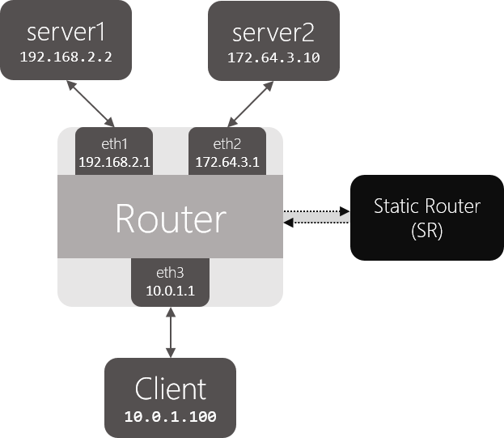

# Assignment 4:

### Due: Friday April 14th at 11:59 PM

## Overview

In this assignment, you will be writing a simple router configured with a static routing table. Your router will receive raw Ethernet frames. It will process the packets just like a real router, then forward them to the correct outgoing interface.

Your task is to implement the forwarding logic so packets go to the correct interface.

This is not a simulation: your router will route real packets to HTTP servers sitting behind your router. When you have finished your router, you should be able to access these servers using regular client software (e.g., `wget/curl`). In addition, you should be able to `ping` and `traceroute` to and through a functioning Internet router. This is the topology you will be using for your development:



You will use Mininet, to set up these topologies of emulated routers and process packets in them. Once your router is functioning correctly, you will be able to perform all of the following operations:

* Ping any of the router's interfaces from the servers and from the VM.
* Traceroute to any of the router's interface IP addresses.
* Ping any of the HTTP servers from the VM (or from the other server).
* Traceroute to any of the HTTP server IP addresses.
* Download a file using HTTP from one of the HTTP servers.

Additional requirements are laid out in the "Requirements" section.

* [Getting Started](#getting-started)
* [Background](#background)
* [Code Overview](#code-overview)
* [Debugging](#debugging)
* [Submitting](#submitting)
* [FAQ](#faq)

## Learning Outcomes

After completing this programming assignment, students should be able to:

* Describe how routers work
* Explain how layer 2 and 3 protocols such as ARP and ICMP work

## Clarifications

* TBA

<a name="getting-started"></a>
## Getting Started

### Virtual Machine
Your assignment will run in a local virtual machine. You can obtain the VM from [here](http://web.eecs.umich.edu/~mosharaf/EECS489/W17/eecs489p4.ova).

### Starter Code
To obtain the starter code, clone the repo into your VM:

`git clone https://github.com/eecs489/p4_starter_code`

The starter code can be found in `path_to_p4/router/`

Your router table can be found in the `rtable` file in the same directory.

### Understanding a Routing Table File
Each line in the routing table (rtable) file is a routing entry and has the following format:

```
prefix        next_hop     netmask          interface
```

Here is the default routing table that you will find on the VM. The first entry is the default route.

```
0.0.0.0       10.0.1.100   0.0.0.0          eth3
192.168.2.2   192.168.2.2  255.255.255.255  eth1
172.64.3.10   172.64.3.10  255.255.255.255  eth2
```

### Building and Running
You should now have all the pieces needed to build and run the router:

* A routing table file that corresponds to the routing table for the router node in that topology
* The starter code

You can build and run the starter code as follows:

```
make
./sr
```

Mininet and POX need to be started for SR to run. From the `path_to_p4` directory, you need to first run `sudo ./run_mininet.sh`, then open a separate terminal and run `sudo ./run_pox.sh`.

<a name="background"></a>
## Background: Routing
This section has an outline of the forwarding logic for a router, although it does not contain all the details. There are two main parts to this assignment: IP forwarding, and handling ARP.

When an IP packet arrives at your router, it arrives inside an Ethernet frame. Your router needs to check if it is the final destination of the packet, and if not, forward it along the correct link based on its forwarding table. The forwarding table names the IP address of the next hop. The router must use ARP to learn the Ethernet address of the next hop IP address, so it can address the Ethernet frame correctly.

### IP Forwarding and ARPs
Given a raw Ethernet frame, if the frame contains an IP packet whose destination is not one of the router's interfaces:

1. Check that the packet is valid (has a correct checksum).
2. Decrement the TTL by 1, and recompute the packet checksum over the modified header.
3. Find out which entry in the routing table has the longest prefix match with the destination IP address.
4. Check the ARP cache for the next-hop MAC address corresponding to the next-hop IP. If it's there, send it. Otherwise, send an ARP request for the next-hop IP (if one hasn't been sent within the last second), and add the packet to the queue of packets waiting on this ARP request.

This is a high-level overview of the forwarding process. More low-level details are below. For example, if an error occurs in any of the above steps, you will have to send an ICMP message back to the sender notifying them of an error. You may also get an ARP request or reply, which has to interact with the ARP cache correctly.

### Protocols to Understand

#### Ethernet
You are given a raw Ethernet frame and have to send raw Ethernet frames. You should understand source and destination MAC addresses and the idea that we forward a packet one hop by changing the destination MAC address of the forwarded packet to the MAC address of the next hop's incoming interface.

#### Internet Protocol
Before operating on an IP packet, you should verify its checksum and make sure it is large enough to hold an IP packet. You should understand how to find the longest prefix match of a destination IP address in the routing table described in the [Getting Started](#getting-started) section. If you determine that a datagram should be forwarded, you should correctly decrement the TTL field of the header and recompute the checksum over the changed header before forwarding it to the next hop.

#### Internet Control Message Protocol
ICMP sends control information. In this assignment, your router will use ICMP to send messages back to a sending host. You will need to properly generate the following ICMP messages (including the ICMP header checksum) in response to the sending host under the following conditions:

* **Echo reply (type 0):** Sent in response to an echo request (`ping`) to one of the router's interfaces. (This is only for echo requests to any of the router's IPs. An echo request sent elsewhere should be forwarded).
* **Destination net unreachable (type 3, code 0):** Sent if there is a non-existent route to the destination IP (no matching entry in routing table when forwarding an IP packet).
* **Destination host unreachable (type 3, code 1):** Sent after five ARP requests were sent to the next-hop IP without a response.
* **Port unreachable (type 3, code 3):** Sent if an IP packet containing a UDP or TCP payload is sent to one of the router's interfaces. This is needed for `traceroute` to work.
* **Time exceeded (type 11, code 0):** Sent if an IP packet is discarded during processing because the TTL field is 0. This is also needed for `traceroute` to work.

Some ICMP messages may come from the source address of any of the router interfaces, while others must come from a specific interface: refer to [RFC 792](https://tools.ietf.org/html/rfc792) for details. As mentioned above, the only incoming ICMP message destined towards the router's IPs that you have to explicitly process are ICMP echo requests. You may want to create additional structs for ICMP messages for convenience, but make sure to use the `packed` attribute so that the compiler doesn't try to align the fields in the struct to word boundaries: [GCC Type Attributes](https://gcc.gnu.org/onlinedocs/gcc-3.2/gcc/Type-Attributes.html).

#### Address Resolution Protocol
ARP is needed to determine the next-hop MAC address that corresponds to the next-hop IP address stored in the routing table. Without the ability to generate an ARP request and process ARP replies, your router would not be able to fill out the destination MAC address field of the raw Ethernet frame you are sending over the outgoing interface. Analogously, without the ability to process ARP requests and generate ARP replies, no other router could send your router Ethernet frames. Therefore, your router must generate and process ARP requests and replies.

To lessen the number of ARP requests sent out, you are required to cache ARP replies. Cache entries should time out after 15 seconds to minimize staleness. The provided ARP cache class already times the entries out for you.

When forwarding a packet to a next-hop IP address, the router should first check the ARP cache for the corresponding MAC address before sending an ARP request. In the case of a cache miss, an ARP request should be sent to a target IP address about once every second until a reply comes in. If the ARP request is sent five times with no reply, an ICMP destination host unreachable is sent back to the source IP as stated above. The provided ARP request queue will help you manage the request queue.

In the case of an ARP request, you should only send an ARP reply if the target IP address is one of your router's IP addresses. In the case of an ARP reply, you should only cache the entry if the target IP address is one of your router's IP addresses.

Note that ARP requests are sent to the broadcast MAC address (`ff-ff-ff-ff-ff-ff`). ARP replies are sent directly to the requester's MAC address.

#### IP Packet Destinations
An incoming IP packet may be destined for one of your router's IP addresses, or it may be destined elsewhere. If it is sent to one of your router's IP addresses, you should take the following actions, consistent with the section on protocols above:

* If the packet is an ICMP echo request and its checksum is valid, send an ICMP echo reply to the sending host.
* If the packet contains a TCP or UDP payload, send an ICMP port unreachable to the sending host.
* Otherwise, ignore the packet.

Packets destined elsewhere should be forwarded using your normal forwarding logic.

<a name="code-overview"></a>
## Code Overview

### Basic Functions
Your router receives and sends Ethernet frames. The basic functions to handle these functions are:

* `sr_handlepacket(struct sr_instance* sr, uint8_t *packet, unsigned int len, char* interface)`
This method, located in `sr_router.c`, is called by the router each time a packet is received. The `packet` argument points to the packet buffer which contains the full packet including the Ethernet header. The name of the receiving `interface` is passed into the method as well.

* `sr_send_packet(struct sr_instance* sr, uint8_t* buf, unsigned int len, const char* iface)`
This method, located in `sr_vns_comm.c`, will send `len` bytes of `buf` out of the interface specified by `iface`. The `buf` parameter should point to a valid Ethernet frame, and `len` should not go past the end of the frame.
You should not free the buffer given to you in `sr_handlepacket()` (this is why you can think of the buffer as being "lent" to you). You are responsible for doing correct memory management on the buffers that `sr_send_packet` borrows from you (that is, `sr_send_packet` will not call `free()` on the buffers that you pass it).

* `sr_arpcache_sweepreqs(struct sr_instance *sr)`
The assignment requires you to send an ARP request about once a second until a reply comes back or you have sent five requests. This function is defined in `sr_arpcache.c` and called every second, and you should add code that iterates through the ARP request queue and re-sends any outstanding ARP requests that haven't been sent in the past second. If an ARP request has been sent 5 times with no response, a destination host unreachable should go back to all the sender of packets that were waiting on a reply to this ARP request.

### Data Structures

#### The Router (`sr_router.h`)
The full context of the router is housed in the struct `sr_instance` (`sr_router.h`). `sr_instance` contains information about topology the router is routing for as well as the routing table and the list of interfaces.

#### Interfaces (`sr_if.c/h`)
After connecting, the server will send the client the hardware information for that host. The stub code uses this to create a linked list of interfaces in the router instance at member `if_list`. Utility methods for handling the interface list can be found at `sr_if.c/h`.

#### The Routing Table (`sr_rt.c/h`)
The routing table in the stub code is read on from a file (default filename `rtable`, can be set with command line option `-r`) and stored in a linked list of routing entries in the current routing instance (the member name is `routing_table`).

#### The ARP Cache and ARP Request Queue (`sr_arpcache.c/h`)
You will need to add ARP requests and packets waiting on responses to those ARP requests to the ARP request queue. When an ARP response arrives, you will have to remove the ARP request from the queue and place it onto the ARP cache, forwarding any packets that were waiting on that ARP request. Pseudocode for these operations is provided in `sr_arpcache.h`. The base code already creates a thread that times out ARP cache entries 15 seconds after they are added for you. You must fill out the `sr_arpcache_sweepreqs()` function in `sr_arpcache.c` that gets called every second to iterate through the ARP request queue and re-send ARP requests if necessary. Psuedocode for this is provided in `sr_arpcache.h`.

#### Protocol Headers (`sr_protocol.h`)
Within the router framework you will be dealing directly with raw Ethernet packets. The stub code itself provides some data structures in `sr_protocols.h` which you may use to manipulate headers easily. There are a number of resources which describe the protocol headers in detail. Network Sorcery's RFC Sourcebook provides a condensed reference to the packet formats you'll be dealing with:

* [Ethernet](http://www.networksorcery.com/enp/protocol/ethernet.htm)
* [IP](http://www.networksorcery.com/enp/protocol/ip.htm)
* [ICMP](http://www.networksorcery.com/enp/protocol/icmp.htm)
* [ARP](http://www.networksorcery.com/enp/protocol/arp.htm)

<a name="requirements"></a>
## Requirements
In summary, your solution:

1. MUST correctly generate ARP request packets.
2. MUST correctly respond to ARP request packets.
    * It MUST only respond if appropriate.
    * It MUST respond from the proper interface.
    * Responses MUST be unicast.
3. MUST correctly handle ARP response packets by populating the ARP cache.
4. MUST generate the correct ICMP messages for these cases:
    * Receive an ICMP echo request.
    * A received packet's destination has no forwarding table entry.
    * The router cannot determine the link layer address of a packet's next hop. "cannot determine" means there is no ARP entry and 5 consecutive ARP requests fail.
    * A UDP or TCP packet is sent to one of the router's interfaces. This MUST generate an ICMP port unreachable message.
    * A packet's TTL, after being decremented, is 0.
5. The router MUST correctly route packets using IPv4 between the Internet and the application servers.
    * It MAY assume no IP options are used.
    * It MUST correctly validate and generate checksums.
    * It MUST decrement the TTL.
    * It MUST forward packets using the forwarding table, selecting an entry with the longest prefix match algorithm.
    * Note that an Ethernet frame payload may be larger than the encapsulated IP packet. That is, there may be some padding bytes after the IP packet. This can occur when an Ethernet interface tries to align frames on 4-byte boundaries.
6. MUST correctly handle `traceroutes` through it (where it is not the end host) and to it (where it is the end host).
7. MUST maintain an ARP cache whose entries are invalidated after a timeout period (timeouts should be on the order of 15 seconds).
8. MUST NOT drop a packet unless there is no matching forwarding table entry, the router cannot determine the next hop link address, or cannot parse the packet.
9. MUST queue all packets waiting for outstanding ARP replies.
10. SHOULD drop a packet waiting for an ARP reply after 5 failed requests for a reply since receiving the packet.

<a name="debugging"></a>
## How to Debug
Because your error might be due to some tiny, low-level mistake, trying to read through pages and pages of `printf()` output is a waste of time. While `printf()` is of course useful, you will be able to debug your code much faster if you also log packets and use `gdb`.

### Protocols: Logging Packets
You can log the packets received and generated by your SR program by using the -l parameter. The file will be in `pcap` format, so you can use Wireshark or `tcpdump` to read it.

```
./sr -l logfile.pcap
```

Besides SR, you can also use Mininet to monitor the traffic that goes in and out of the emulated nodes, i.e., `router`, `server1` and `server2`. Mininet provides direct access to each emulated node. Using server1 as an example, to see the packets in and out of it, go to the Mininet CLI:

```
mininet> server1 sudo tcpdump -n -i server1-eth0
```

Or you can bring up a terminal inside `server1` by

```
mininet> xterm server1
```

Then inside the newly popped xterm,

```
xterm# sudo tcpdump -n -i server1-eth0
```

### Router
#### Debugging Functions
We have provided you with some basic debugging functions in `sr_utils.h`, `sr_utils.c`. Feel free to use them to print out network header information from your packets. Below are some functions you may find useful:

* `print_hdrs(uint8_t *buf, uint32_t length)`
Prints out all possible headers starting from the Ethernet header in the packet.
* `print_addr_ip_int(uint32_t ip)`
Prints out a formatted IP address from a `uint32_t`. Make sure you are passing the IP address in the correct byte ordering.

<a name="submitting"></a>
## Submitting

You git repository must include the following:
* All the code for your router in a folder called `router`.
* A `README` file with the names and umich uniqnames of the group members. Also specify in this `README` if you choose to use any late days for this project.

<a name="faq"></a>
## FAQ
* How long is this assignment?
    In our reference solution, we added around 500 lines of C, including whitespace and comments. Of course, your solution may need fewer or more lines of code, but this gives you an idea a rough idea of the size of the assignment to a first approximation.
* Can I have a reference implementation?
    To help you debug your topologies and understand the required behavior we provide a reference binary and you can find it at `path_to_p4/sr_solution`.

## Acknowledgements
This programming assignment is based on Stanford's lab 3 from CS 144: Introduction to Computer Networking.
